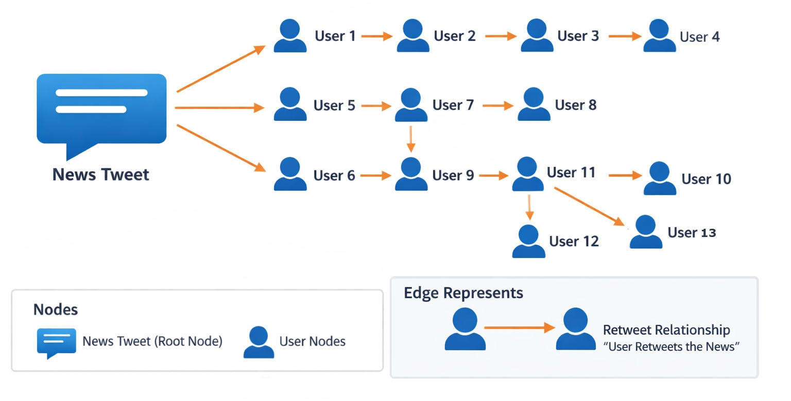

# 📰 Real Or Fake?! 🕵️‍♂️
## GNN-based Fake News Detection Challenge

Welcome to the **GNN-based Fake News Detection Challenge**! This competition focuses on detecting fake news propagation on Twitter using Graph Neural Networks (GNNs). 


**[Live Leaderboard](https://tugaahmed.github.io/Real_Or_Fake/leaderboard.html)**

---


## Repository Structure

```text
Real_Or_Fake/
├── data/
│   ├── public/
│   │   ├── A.txt
│   │   ├── new_bert_feature.npz
│   │   ├── new_spacy_feature.npz
│   │   ├── new_profile_feature.npz
│   │   ├── node_graph_id.npy
│   │   ├── train_idx.npy
│   │   ├── train_labels.csv
│   │   ├── val_idx.npy
│   │   ├── val_labels.csv
│   │   └── test_idx.npy
│   └── private/   #hidden
│       └── test_labels.csv  
├── submissions/
│   └── sample_submission/
│       └── predictions.csv
├── models/
│   ├── model.py
│   └── saved_model.model
├── dataloader.py
├── evaluate.py
├── test.py
├── train.py
├── requirements.txt
├── README.md
└── LICENSE
```


---

## 📦 Dataset Overview

This competition uses the **GossipCop** dataset, which contains Twitter news propagation graphs. Each graph represents the spread of a single news article

Each graph corresponds to a news article (root node) and all users who engaged with it (child nodes).
  - Nodes: represent either the news article or a user who interacted with it.
  - Edges: represent interactions or retweets between nodes. Only edges connecting nodes in the same graph are used for that graph
  - The **root node** corresponds to the news article itself.
  - **Child nodes** correspond to users who retweeted or engaged with the news.

Graphs are used as input to Graph Neural Networks (GNNs) to classify news as **Real (0)** or **Fake (1)**.

The dataset is split into **public** and **private** parts:

- **Public:** Available to participants for training, validation, and testing.
- **Private:** Hidden labels used for submission and leaderboard evaluation.

---

### Graph Structure 
<p align="center">
  
</p> 

The graph connectivity and graph assignment information are stored in the following files:

- **`A.txt`**  
  Contains all edges in the dataset. Each row is an edge represented by two node IDs (source and target).  
  **Type:** Integer array, shape `(num_edges, 2)`  

- **`node_graph_id.npy`**  
  Maps each node to its corresponding graph. The value at index `i` indicates the graph ID of node `i`.  
  **Type:** Integer array, shape `(num_nodes,)`  
  

### Node Features

Each node in the graph has **text embeddings** and optionally **user profile features**.  

#### 1. Text Embeddings
- **BERT embeddings:** `768-dim` vectors representing the content of the news or user historical tweets.  
  File: `new_bert_feature.npz`  
- **spaCy embeddings:** `300-dim` vectors representing the content of the news or user historical tweets.  
  File: `new_spacy_feature.npz`  

#### 2. User Profile Features (10-dim)
These features are derived from the Twitter user object using the Twitter API:  

1. Verified? (`0` or `1`)  
2. Geo-spatial enabled? (`0` or `1`)  
3. Number of followers  
4. Number of friends  
5. Status/tweet count  
6. Number of favorites  
7. Number of lists the user is part of  
8. Account age (months since Twitter launch)  
9. Number of words in the user’s name  
10. Number of words in the user’s description  

File: `new_profile_feature.npz`  

### Data Splits
- **`train_idx.npy`**  
  Contains the list of graph IDs used for training.  
  **Type:** Integer array, shape `(num_train_graphs,)`  
 

- **`val_idx.npy`**  
  Contains the list of graph IDs used for validation.  
  **Type:** Integer array, shape `(num_val_graphs,)`  


- **`test_idx.npy`**  
  Contains the list of graph IDs used for testing. Labels are hidden in the private folder for competition evaluation.  
  **Type:** Integer array, shape `(num_test_graphs,)`  
  
  
### Graph Labels

Each graph in the dataset has a label indicating whether the news is **real** or **fake**:

- `0` → Real news  
- `1` → Fake news  

Graph labels are stored separately for different splits:

- **Training labels:** `train_labels.csv`  
- **Validation labels:** `val_labels.csv`  
- **Test labels (hidden for competition evaluation):** `private/test_labels.csv`  
- Each CSV file contains two columns:
    1. `id` → Graph ID  
    2. `y_true` → Label (0 or 1)


### Dataset Statistics

Here are some key statistics for the news propagation graphs in the competition datasets:

| Dataset      | #Graphs (Fake) | #Total Nodes | #Total Edges | Avg. Nodes per Graph |
|-------------|----------------|--------------|--------------|--------------------|
| GossipCop (GOS)  | 5,464 (2,732)   | 314,262      | 308,798      | 58                 |


---

## 📝 Problem Statement

**Task:** Classify each news propagation graph as real or fake.

### Baseline Model Description

The baseline model is a **Graph Neural Network (GNN)** for fake news detection implemented in `model.py`. Its main components:

- **Graph Attention Layers (GAT):** 3 layers to learn node embeddings from the propagation graph.  
- **Global Max Pooling:** Aggregates node embeddings to a single graph-level representation.  
- **Root Node Transformation:** Linear layer processes the root node (news article) features.  
- **Concatenation & Output:** Combines graph representation and root node features, then passes through a linear layer with **sigmoid** to predict fake/real news.  

**Features used in baseline:**  
  - spaCy Text embeddings of news and historical user tweets
    
**Output:**
  - Probability that a news graph is fake.
    
**Baseline performance on the validation set:**
- **Accuracy:** 0.7261  
- **F1 score:** 0.7068
---

## 🚀 Getting Started

Follow these steps to replicate the baseline results and build your own implementation.

### 1️⃣ Clone the Repository

```bash
git clone https://github.com/TugaAhmed/Real_Or_Fake.git
cd Real_Or_Fake
```

### 2️⃣ Set Up Environment

Create a virtual environment and install the required dependencies:

```bash
python -m venv venv
source venv/bin/activate      # On Windows: venv\Scripts\activate
pip install -r requirements.txt
```

### 3️⃣ Download and Prepare the Dataset

Download the public dataset ZIP file from the link provided in the dataset section.

Extract the contents inside the data/ folder so that the folder structure looks like this:

```text
data/
└── public/
    ├── A.txt
    ├── new_bert_feature.npz
    ├── new_spacy_feature.npz
    ├── new_profile_feature.npz
    ├── node_graph_id.npy
    ├── train_idx.npy
    ├── train_labels.csv
    ├── val_idx.npy
    ├── val_labels.csv
    └── test_idx.npy

```

4️⃣ Train the Baseline Model

Run the training script to train the GNN on the dataset:
```bash
python train.py
```

This will train the model and generate `saved_model.model` in the `models/` folder.

The saved model corresponds to the one with the best validation accuracy.

Metrics tracked during training: **Accuracy and F1 score**.

5️⃣ Generate Predictions

After training, run the test script to generate predictions:
```bash
python test.py
```
This will create a predictions.csv file inside the submissions/ folder.

The CSV contains two columns: **id** , **y_pred**

6️⃣ Evaluate Predictions

You can evaluate your predictions using the evaluation script:

```bash
python evaluate.py
```

This script compares predictions.csv with the ground truth hidden labels in private/test_labels.csv.

**Metrics reported include:**    
   - Accuracy
   - F1 Score
     

## 📤 Submission Workflow

Follow these steps to participate in the competition and submit your results.

---

### 1️⃣ Train Your Model Locally

- Use the public dataset in `data/public/`.
- Train your model using your own implementation.
- Generate predictions for the **test set**.
- Create a `predictions.csv` file.

---

### 2️⃣ Prepare Submission Files

Each submission must include:

#### ✅ `predictions.csv`

Must contain exactly two columns:

| Column  | Description |
|----------|------------|
| `id`     | graph identifier (must exactly match public test IDs) |
| `y_pred` | Predicted probability or score |

⚠️ IDs must exactly match those in the public test input file.  
Incorrect formatting will cause automatic validation failure.

#### ✅ `metadata.json`

This file must indicate how the submission was produced:

Example:
```json
{
  "team_name": "your_team_name",
  "submission_type": "human | llm | human+llm",
  "notes": "Optional description"
}
```
3️⃣ Submission Directory Structure

Your Pull Request must add files in the following structure:
```
submissions/inbox/<team_name>/<run_id>/predictions.csv
submissions/inbox/<team_name>/<run_id>/metadata.json
```
Example:
```
submissions/inbox/team_alpha/run_01/predictions.csv
submissions/inbox/team_alpha/run_01/metadata.json
```
4️⃣ Submit via Pull Request

Fork the repository.

Add your submission files in the correct directory.

Open a Pull Request (PR) to the main repository.

5️⃣ Automatic Validation & Scoring

When the Pull Request is opened:
  - Submission format is validated
  - Predictions are scored using hidden test labels
  - Score is posted automatically as a PR comment
  - Invalid submissions fail automatically.

6️⃣ Leaderboard Update

Once your Pull Request is approved and merged:
  - Your score is appended to leaderboard/leaderboard.csv
  - The leaderboard is automatically updated
  - The interactive GitHub Pages leaderboard reflects the new score
